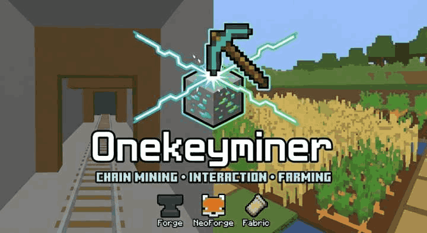

# OneKeyMiner

<p align="center">
  
</p>

<p align="center">
  <strong>Chain Mining, Interaction & Planting - All in One!</strong>
</p>

<p align="center">
  <a href="https://github.com/Mai-xiyu/OneKeyMiner/releases"></a>
  <a href="LICENSE_EN.md"></a>
  
  
  
</p>

<p align="center">
  <a href="api-reference.md">🔧 API Documentation</a>
</p>

---

## ✨ Features

- ⛏️ **Chain Mining** - Break connected blocks of the same type at once
- ✂️ **Chain Interaction** - Batch shearing, hoeing, stripping, path making
- 🌱 **Chain Planting** - Auto-plant crops on adjacent farmland
- 🎮 **Multi-Platform** - Supports Fabric, NeoForge, and Forge
- ⚙️ **Highly Configurable** - Customize max blocks, distance, activation mode
- 🏷️ **Tag Support** - Use tags like `#minecraft:logs`, `#c:ores`
- 🛡️ **Protection** - Auto-stop when tool durability or hunger is low
- 🔌 **API Available** - Easy integration for other mods

---

## 📥 Installation

### Requirements

| Component | Version |
|-----------|---------|
| Minecraft | 26.1 |
| OneKeyMiner | 1.6.7 |
| Java | 25 |
| Fabric Loader | 0.18.4 |
| Fabric API | 0.144.0+26.1 |
| NeoForge | 26.1.0.1-beta |
| Forge | 62.0.1 |

### Download

Download the latest release from [GitHub Releases](https://github.com/Mai-xiyu/OneKeyMiner/releases).

Choose the correct version for your platform:
- `onekeyminer-fabric-1.6.7-26.1.jar` for Fabric
- `onekeyminer-neoforge-1.6.7-26.1.jar` for NeoForge
- `onekeyminer-forge-1.6.7-26.1.jar` for Forge

Use the matching platform JAR on both the client and server. A universal JAR
is not published because loader-specific Minecraft mappings cannot provide a
single binary-compatible public API to add-on mods.

### Multiplayer configuration

On dedicated servers, global limits, feature switches, and teleport permission gates are
server-authoritative. While connected to a remote server, the config screen shows and saves
only client-owned preferences: selected shape plus drop/experience teleport requests. Local
and integrated-singleplayer screens retain the complete configuration.

Preference synchronization uses the versioned v3 protocol on all three loaders. A changed
preference allocates a new sequence and immutable snapshot; transport and ACK retries reuse
that exact pair. Synchronization completes only when the matching server ACK reports the
applied shape, server enable state, preview limits, diagonal policy, effective teleport values,
and supported capabilities. The result is connection-local and never overwrites saved client
requests. Clients refresh it periodically so server hot reloads converge. Incompatible protocol
versions use distinct payload IDs or exact channel negotiation and are rejected before decoding.

---

## 🎮 Quick Start

### Chain Mining
1. Hold a pickaxe or axe
2. **Hold the activation key** (default: `` ` `` backtick)
3. Break an ore or log
4. Watch connected blocks break automatically!

### Chain Interaction  
1. Hold a hoe, axe, shovel, or shears
2. **Hold the activation key**
3. Right-click to interact with blocks
4. Adjacent interactable blocks are also processed!

### Chain Planting
1. Hold seeds or crops
2. **Hold the activation key**
3. Right-click on farmland
4. Adjacent empty farmland is planted automatically!

---

## ⚙️ Configuration

Configuration file location: `config/onekeyminer.json`

### Key Settings

| Option | Default | Description |
|--------|---------|-------------|
| `enabled` | `true` | Enable/disable the mod |
| `maxBlocks` | `64` | Maximum blocks per chain operation |
| `maxDistance` | `16` | Maximum search distance |
| `allowDiagonal` | `true` | Allow diagonal block connections |
| `consumeDurability` | `true` | Consume tool durability |
| `preserveDurability` | `1` | Stop when durability reaches this value |
| `consumeHunger` | `true` | Consume hunger for each block |
| `minHungerLevel` | `1` | Stop when hunger reaches this value |
| `allowBareHand` | `true` | Allow chain mining without tools |
| `teleportDrops` | `false` | Client request to teleport drops to player inventory |
| `teleportExp` | `false` | Client request to teleport experience to player |
| `allowClientTeleportDrops` | `true` | Server policy gate for client-requested drop teleport |
| `allowClientTeleportExp` | `true` | Server policy gate for client-requested experience teleport |

### Block/Tool Lists

```json
{
  "customWhitelist": ["mymod:custom_ore"],
  "blacklist": ["minecraft:bedrock"],
  "toolWhitelist": [],
  "toolBlacklist": ["minecraft:wooden_pickaxe"]
}
```

---

## 🔧 For Developers

OneKeyMiner provides an API for mod developers. It does not currently publish a
documented Maven repository or stable Maven coordinate. Copy the production JAR
for the target platform into your add-on project's `libs/` directory and use a
compile-only dependency.

### Adding Dependency

```groovy
// Fabric Loom
modCompileOnly files("libs/onekeyminer-fabric-1.6.7-26.1.jar")

// ForgeGradle
compileOnly fg.deobf(files("libs/onekeyminer-forge-1.6.7-26.1.jar"))

// NeoGradle or ModDevGradle
compileOnly files("libs/onekeyminer-neoforge-1.6.7-26.1.jar")
```

Install OneKeyMiner separately at runtime and declare it in the add-on's loader
metadata as an optional or required dependency.

### Basic API Usage

```java
import org.xiyu.onekeyminer.api.OneKeyMinerAPI;
import org.xiyu.onekeyminer.api.event.ChainEvents;

// Register custom blocks
OneKeyMinerAPI.registerBlock("mymod:custom_ore");
OneKeyMinerAPI.registerBlockTag("#mymod:ores");

// Register custom tools
OneKeyMinerAPI.whitelistTool("mymod:super_pickaxe");

// Current-connection server result; saved local requests remain unchanged.
OneKeyMinerAPI.getAcknowledgedServerPreferences().ifPresent(ack -> {
    System.out.println("Server shape: " + ack.appliedShapeId());
    System.out.println("Server max blocks: " + ack.maxBlocksApplied());
});

// Listen to events
ChainEvents.registerPreActionListener(event -> {
    // Custom logic before chain operation
});
```

The server remains authoritative: API listeners and client preferences cannot
bypass target, protection, distance, durability, hunger, or server-policy
checks. Original right-click interactions complete through the loader/vanilla
path once; only then are validated derived targets dispatched. A throwing
`PreActionEvent` listener fail-closes all chain work that has not already
completed; it cannot roll back an original interaction that already succeeded.
Native actions must also produce their expected block/entity transition, so a
button, container, composter, or protection-mod cancellation result cannot
authorize unrelated neighboring work.

`ConfigManager.getConfig()` returns a defensive copy. Use
`ConfigManager.editConfig(key, editor)` for atomic changes. The deprecated
`skipPermissionCheck` context option is ignored.

Teleport APIs explicitly separate client request, server policy, and the
per-player effective result. Use `setLocalDropTeleportRequested` /
`setLocalExperienceTeleportRequested` on a physical client,
`setClientDropTeleportAllowed` / `setClientExperienceTeleportAllowed` on the
logical server, and query `isDropTeleportEffective(ServerPlayer)` /
`isExperienceTeleportEffective(ServerPlayer)` during server-side gameplay.
The older `*Teleport*Enabled` methods remain compatible but are deprecated
aliases for local requests.

See [API Documentation](api-reference.md) for the complete 26.1 reference,
including the current event, shape, context, and tool-rule signatures. Shape IDs
are limited to 128 characters.

---

## 🌟 Addon Development

Want to build addon mods or integrations? You can use our API to register blocks/tools and listen to chain events.

---

## 📋 Compatibility

### Supported Mod Loaders
- ✅ Fabric (with Fabric API)
- ✅ NeoForge
- ✅ Forge

### Tested Mods
- Mod Menu (Fabric)
- Most ore/tool mods

### Protection Plugin Support
Uses `ServerPlayerGameMode#destroyBlock()` for proper integration with:
- FTB Chunks
- Claim plugins
- Other protection mods

---

## 🌿 Branching & Releases

- **Branching**: Each Minecraft version uses its own branch (e.g., `26.1`).
- **Latest**: The latest Minecraft version is maintained on `master`.
- **Tag format**: `<branch>-<mod_version>` (example: `26.1-1.6.7`).


## 🐛 Issues & Contributions

Found a bug or have a suggestion?

- [Open an Issue](https://github.com/Mai-xiyu/OneKeyMiner/issues)
- [Submit a Pull Request](https://github.com/Mai-xiyu/OneKeyMiner/pulls)

---

## 📜 License

This project uses the **Code Repository General License Agreement v1.2**,
a custom non-commercial license. It is not MIT-licensed. See
[LICENSE_EN.md](LICENSE_EN.md) or [LICENSE_CN.md](LICENSE_CN.md) for the
complete terms, including the separate requirements for derivative and
dependent works.

---

## 💖 Credits

- **Author**: [Mai_xiyu](https://github.com/Mai-xiyu)
- **Project Origin**: The original OneKeyMiner had separate projects and branches for each mod loader and Minecraft version. This unified version was created to consolidate all platforms into a single codebase with completely refactored code.
- **Special Thanks**: All contributors and testers

---

<p align="center">
  Made with ❤️ for the Minecraft community
</p>
